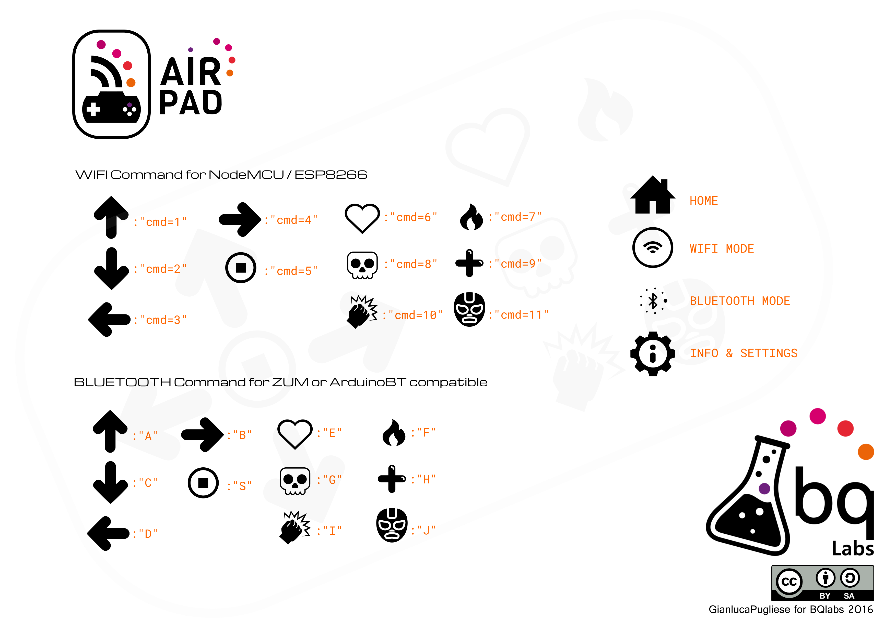

<table>
<tr>
<td>

</td>
</tr>
</table>

# AirPAD  

Android app to move robots over WiFi or Bluetooth

## Files

###APP

**AirPad Folder**  source files

**AirPAD.aia**  source file for MIT App Inventor

**AirPad v0.1.apk**  IS THE APP!

###HOW TO INSTALL

- Copy **AirPad v0.1.apk** in the memory of your smartphone
- in Android Settigs allow the installation for app without digital signs
- RUN AirPaD :)     

###FIRMWARE

**AirPad_BT_SERVO**  Simple sketch to move servomotors based robots over Bluetooth (the sketch is made for [Brian](https://github.com/bqlabs/Brian) but is easy to customize for your robots

**AirPad_ESP8266_DCmotor**  Simple sketch to move DCmotors based robots over WiFi, using an ESP8266 or NodeMCU (the sketch is made for [Node_WS](https://github.com/bqlabs/NODE_WS) or [Omniboard](https://github.com/bqlabs/OmniBoard) but is easy to customize for your robots

## COMMANDS

## Contributing
1. Fork it!
2. Create your feature branch: `git checkout -b my-new-feature`
3. Commit your changes: `git commit -am 'Add some feature'`
4. Push to the branch: `git push origin my-new-feature`
5. Submit a pull request :D

## Credits

Designed by Gianluca Pugliese [Owensource](https://www.owensource.com) 

based on PrintBot app

Sponsored by BQ untill March 2016

- [Luis Diaz tutorial](http://diwo.bq.com/controlando-un-printbot-con-botones-en-app-inventor/)

## License

This robot is licensed under a [Creative Commons Attribution-ShareAlike 4.0 International License](http://creativecommons.org/licenses/by-sa/4.0/). Please read the LICENSE files for more details.

Este robot tiene una licencia [Creative Commons Attribution-ShareAlike 4.0 International License](http://creativecommons.org/licenses/by-sa/4.0/). Por favor, lea los ficheros LICENSE para más detalles
